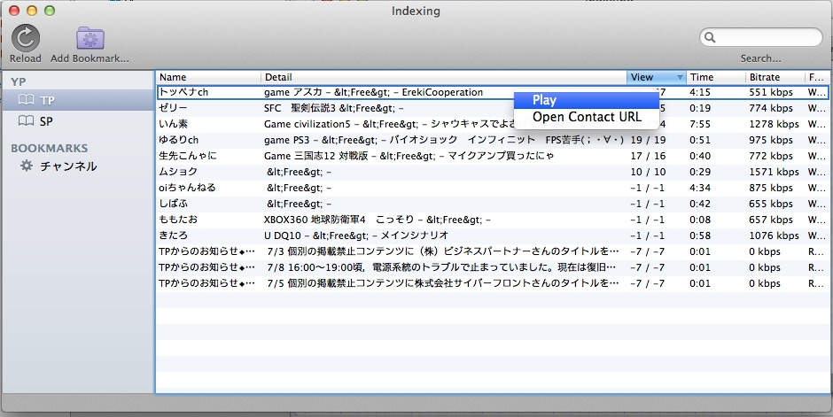

Indexing
====
Indexing is a Mac Application.
It browsing PeerCast channels by accessing to index.txt.

# Screenshots

# Acknowledge
Indexing is using these libraries.

- [AFNetworking v1.3.0](https://github.com/AFNetworking/AFNetworking)
- [MagicalRecord v2.1](http://github.com/magicalpanda/MagicalRecord)
- [CocoaLumberjack v1.6.2](https://github.com/robbiehanson/CocoaLumberjack)

For test, using these libraries.

- [GHUnitOSX v0.5.6](https://github.com/gabriel/gh-unit)
- [OCMock v2.1.1](http://ocmock.org/)

# License
Indexing is licensed by under the GNU GPL v3.
See [Detail](./LICENSE).

